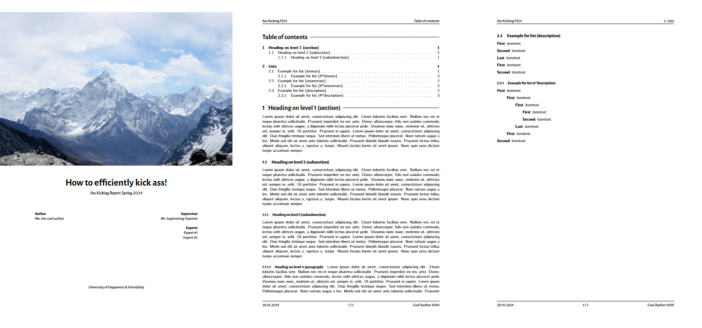

# Chribel Academic Quarto

A quarto template which can be used to write a bachelor thesis and other stuff. It uses `pdflatex`!

> [!NOTE]
> *Chribel* means doodle or scribbe in Swiss German. It has no meaning whatsoever, just sounds silly :)

> [!WARNING]
> This is not a definitive version of the template and still has a bunch of stuff which requires special attention. If time is sufficient I might turn some of the $\LaTeX$ components into Quarto properties.

## Creating a New Document

To create a new document using this format, use the `use` quarto command in the terminal.

```bash
quarto use template joelvonrotz/chribel-academic-quarto
```

This will create a new directory with an example document that uses this format. Keep the file `template_document.qmd` and delete the others.

## Using with an Existing Document

To add this format to an existing document:

```bash
quarto add joelvonrotz/chribel-academic-quarto
```

Then, add the format to your document options (variants shown below):

```yaml
format: chribel-academic-quarto-pdf
```

```yaml
format:
  chribel-academic-quarto-pdf:
    ... # for additional options
```

> [!NOTE]
> As this template is based on the `pdf`-format, all the same options can be used. See [Quarto: PDF Options](https://quarto.org/docs/reference/formats/pdf.html)

> [!WARNING]
> There might be some unwanted files added to it, such as `template.png`. Delete all the unwanted files!

## Using in a project

To use the template for a project, run either commands from the previous chapter.

### Method: `quarto add ...`

Create a `_quarto.yml` file and insert the minimum options. Following is with the example `main_document.qmd`

```yaml
project:
  type: chribel-academic-quarto
  render:
    - main_document.qmd
```

Add other options from the Options chapter below or from the template documents.

### Method: `quarto use ...`

Remove everything except `_extentions`-folder, `_quarto.yml`. Create a new main document such as `main_document.qmd` or `summary_main.qmd` and edit the render target in the `_quarto.yml` file. Following is with the example `main_document.qmd`

```yml
project:
  type: chribel-academic-quarto
  render:
    - main_document.qmd
...
```

## Options

The template comes with a couple of options, of which some you might need to change, depending on your language or the amount of people part of the project (authors, supervisors, experts).

A lot of the options are the same as the ones from the Quarto [PDF options](https://quarto.org/docs/reference/formats/pdf.html).

### Title & Subtitle

```yaml
title: "Silly title for silly writing"
subtitle: "Course for silly writing"
```

### Authors, Supervisors and Experts

The template supports multiple authors (**NO [COMPLEX AUTHOR](https://quarto.org/docs/journals/authors.html#combinations)**), multiple supervisors and multiple experts.

```yaml
author:
  - "Author 1"
  - "Author 2"
  - "Author 3"
supervisor:
  - "Supervisor 1"
  - "Supervisor 2"
  - "Supervisor 3"
expert:
  - "Expert 1"
  - "Expert 2"
  - "Expert 3"
```

Don't forget to update the respective titles for plural or singular!

```yaml
author-title: "Author"
supervisor-title: "Supervisor"
expert-title: "Expert"
```

### University

This tag adds the university name to the bottom of the cover page!

```yaml
university: "University of Happiness & Friendship"
```

### Cover Image

Adds a image to the cover page above the title. When emitted adds vertical spacing.

```yaml
cover-image: "path/to/coverimage.jpg"
```

### Language

> [!NOTE]
> Just two Quarto options, which might be useful for you.

```yaml
lang: en-GB
babel-lang: ukenglish
```

### Header and Footer

Using the LaTeX package `fancyhdr`, 

```yaml
fancyhdr:
  header:
    right:  "\\texttt{fancyhdr.header.right}"
    center: "\\texttt{fancyhdr.header.center}"
    left:   "\\texttt{fancyhdr.header.left}"
  footer:
    right:  "\\texttt{fancyhdr.footer.right}"
    center: "\\texttt{fancyhdr.footer.center}"
    left:   "\\texttt{fancyhdr.footer.left}"
```

An example would be:

```yaml
fancyhdr:
  header:
    right: "\\nouppercase{\\rightmark}" # add current section title
    center: ""
    left: "Ass Kicking FS24"
  footer:
    right: "Cool Author 3000"
    center: "\\thepage\\ / \\pageref{LastPage}"
    left: "\\today"
```

### Date Format

Changing the date format is a bit finicky, but it is possible. Following example sets the date format to 'DD.MM.YYYY'.

```latex
\usepackage[datesep=.]{datetime2}
\DTMsetdatestyle{ddmmyyyy}
```

or in the project YAML or document frontmatter

```yaml
format:
  chribel-academic-quarto-pdf:
    include-in-header:
    - text: "\\usepackage[datesep=.]{datetime2}"
    - text: "\\DTMsetdatestyle{ddmmyyyy}"
```

> [!IMPORTANT]
> `\today` needs to be replaced with `\DTMtoday` in the document.

### Font-Family

By default no fonts are set (the default LaTeX font is used). To change this, fonts from the [LaTeX font catalogue](https://tug.org/FontCatalogue/) are added to the option `chirbel-fontfamily`. An entry must have a `name` option and **may** have a `options` (used for scaling for example).

```yaml
chribel-fontfamily:
- name: 
  options:
- name: 
- name:
  options:
```

> [!IMPORTANT]
> Depending on the font, it needs to be loaded first before others to only adapt specific styles. This is simply done by adding this font first into the list. See the following example.

An example with a specific loading sequence to get the *template_document.qmd* style:

```yaml
chribel-fontfamily:
  - name: AlegreyaSans      # used for section headings, title page
  - name: cmbright          # used for paragraph and math
  - name: inconsolata
    options: "scaled=0.95"  # for code blocks
```

## Example

There are two examples, which render to `.pdf`-documents.

- \[[template_document.qmd](template_document.qmd)\]: document using the YAML [frontmatter](https://quarto.org/docs/manuscripts/authoring/vscode.html#front-matter) 
- \[[template_project.qmd](template_project.qmd)\]: [project](https://quarto.org/docs/projects/quarto-projects.html) using the document options from [_quarto.yml](_quarto.yml).

## Defaults values (found in `_extension.yml`)

```yaml
pdf-engine: pdflatex
documentclass: article

geometry:
  - "top=30mm"
  - "bottom=30mm"
  - "left=25mm"
  - "right=25mm"
pagenumbering: none
papersize: a4
fontenc: T1
fontsize: 10pt

include-before-body: 
  - config/before-content.tex
include-in-header:
  - config/preamble.tex
template-partials:
  - partials/before-body.tex
  - partials/before-title.tex

cite-method: biblatex
biblio-style: ieee

toc-depth: 3
number-sections: true

fig-pos: H
fig-align: center

code-block-bg: "#f7f7f7"
code-line-numbers: true
highlight-style: github

author-title: "Author"
supervisor-title: "Supervisor"
expert-title: "Expert"
```